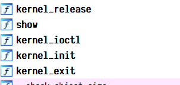

# Kernel 扫盲

## 什么是Kernel

kernel 把用户层和硬件层连接并交互，即将用户层产生的 I/O 要求转义成指令，对如 I/O，权限控制，系统调用，进程管理，内存管理的场景进行处理。

模块通常用来实现一种文件系统、一个驱动程序或者其他内核上层的功能，kernel 通过加载这些模块来实现某种功能，我们则可以通过 read ioctl 等函数来打开使用这些模块。

所以 Kernel pwn 便是要我们在 kernel 执行某种模块的功能的时候拿到内核权限。

## 常见的相关指令

模块相关shell指令

> - **insmod**: 将指定模块加载到内核中
> - **rmmod**: 从内核中卸载指定模块
> - **lsmod**: 列出已经加载的模块
> - **modprobe**: 添加或删除模块，modprobe 在加载模块时会查找依赖关系

从下面的 init shell 脚本看看常见的一些命令，实际上所有的 init 脚本差不多都是这几个命令

```shell
#!/bin/sh

mkdir /tmp
mount -t proc none /proc
mount -t sysfs none /sys
mount -t debugfs none /sys/kernel/debug
mount -t devtmpfs devtmpfs /dev
mount -t tmpfs none /tmp
mdev -s
echo -e "Boot took $(cut -d' ' -f1 /proc/uptime) seconds"

insmod /test.ko
chmod 666 /dev/kernelpwn
chmod 740 /flag
echo 1 > /proc/sys/kernel/kptr_restrict
echo 1 > /proc/sys/kernel/dmesg_restrict
chmod 400 /proc/kallsyms

poweroff -d 120 -f &
setsid /bin/cttyhack setuidgid 1000 /bin/sh

umount /proc
umount /tmp

poweroff -d 0  -f
```

> mount 便是挂载文件系统，将对应虚拟文件系统挂载到该目录下，而 umount 显然是和它一对的。
>
> mdev -s 则是在加载驱动过程中，根据驱动程序，在/dev下自动创建设备节点。
>
> insmod 显然就是加载该驱动模块，在模块中的 kernel_init 函数中便有设备节点名称
>
> setsid 创建一个对应着进程号的进程

## 系统调用

系统调用，指的是用户空间的程序向操作系统内核请求需要更高权限的服务，比如 IO 操作或者进程间通信。系统调用提供用户程序与操作系统间的接口，部分库函数（如 scanf，puts 等 IO 相关的函数实际上是对系统调用的封装（read 和 write））。

也就是说，系统调用使用的是内核态，我们用户只能从接口去使用系统调用。

### ioctl

操作系统提供了内核访问标准外部设备的系统调用，因为大多数硬件设备只能够在内核空间内直接寻址, 但是当访问非标准硬件设备这些系统调用显得不合适, 有时候用户模式可能需要直接访问设备。

内核被设计成可扩展的，可以加入一个称为设备驱动的模块，驱动的代码允许在内核空间运行而且可以对设备直接寻址。一个 Ioctl 接口是一个独立的系统调用，通过它用户空间可以跟设备驱动沟通。对设备驱动的请求是一个以设备和请求号码为参数的 Ioctl 调用，如此内核就允许用户空间访问设备驱动进而访问设备而不需要了解具体的设备细节，同时也不需要一大堆针对不同设备的系统调用。

该函数定义如下

```c
int ioctl(int fd, unsigned long request, ...);
```

第一个参数为打开设备 (open) 返回的文件描述符，第二个参数为用户程序对设备的控制命令，再后边的参数则是一些补充参数，与设备有关。

```c
__int64 __fastcall kernel_ioctl(file *file, unsigned int cmd, unsigned __int64 arg)
```

如上图的这个实例就总共只有三个参数，随后该函数经过这三个参数来执行不同的命令。



又如上图，该模块就只可以用 ioctl

## struct cred

kernel 记录了进程的权限，更具体的，是用 cred 结构体记录的，每个进程中都有一个 cred 结构，这个结构保存了该进程的权限等信息（uid，gid 等），如果能修改某个进程的 cred，那么也就修改了这个进程的权限，结构体定义如下

```c
struct cred {
    atomic_t    usage;
#ifdef CONFIG_DEBUG_CREDENTIALS
    atomic_t    subscribers;    /* number of processes subscribed */
    void        *put_addr;
    unsigned    magic;
#define CRED_MAGIC  0x43736564
#define CRED_MAGIC_DEAD 0x44656144
#endif
    kuid_t      uid;        /* real UID of the task */
    kgid_t      gid;        /* real GID of the task */
    kuid_t      suid;       /* saved UID of the task */
    kgid_t      sgid;       /* saved GID of the task */
    kuid_t      euid;       /* effective UID of the task */
    kgid_t      egid;       /* effective GID of the task */
    kuid_t      fsuid;      /* UID for VFS ops */
    kgid_t      fsgid;      /* GID for VFS ops */
    unsigned    securebits; /* SUID-less security management */
    kernel_cap_t    cap_inheritable; /* caps our children can inherit */
    kernel_cap_t    cap_permitted;  /* caps we're permitted */
    kernel_cap_t    cap_effective;  /* caps we can actually use */
    kernel_cap_t    cap_bset;   /* capability bounding set */
    kernel_cap_t    cap_ambient;    /* Ambient capability set */
#ifdef CONFIG_KEYS
    unsigned char   jit_keyring;    /* default keyring to attach requested
                     * keys to */
    struct key __rcu *session_keyring; /* keyring inherited over fork */
    struct key  *process_keyring; /* keyring private to this process */
    struct key  *thread_keyring; /* keyring private to this thread */
    struct key  *request_key_auth; /* assumed request_key authority */
#endif
#ifdef CONFIG_SECURITY
    void        *security;  /* subjective LSM security */
#endif
    struct user_struct *user;   /* real user ID subscription */
    struct user_namespace *user_ns; /* user_ns the caps and keyrings are relative to. */
    struct group_info *group_info;  /* supplementary groups for euid/fsgid */
    struct rcu_head rcu;        /* RCU deletion hook */
} __randomize_layout;
```

## 关键函数

- printf() -> **printk()**，但需要注意的是 printk() 不一定会把内容显示到终端上，但一定在内核缓冲区里，可以通过 `dmesg` 查看效果
- memcpy() -> **copy_from_user()/copy_to_user()**
  - copy_from_user() 实现了将用户空间的数据传送到内核空间
  - copy_to_user() 实现了将内核空间的数据传送到用户空间
- malloc() -> **kmalloc()**，内核态的内存分配函数，和 malloc() 相似，但使用的是 `slab/slub 分配器`
- free() -> **kfree()**，同 kmalloc()

## 内核安全保护

- SMEP: Supervisor Mode Execution Protection，当处理器处于 `ring0` 模式，执行 `用户空间` 的代码会触发页错误。（在 arm 中该保护称为 `PXN`）
- SMAP: Superivisor Mode Access Protection，类似于 smep，通常是在访问数据时。
- mmap_min_addr: 可用于申请的最小的地址
- FGKASLR：以函数粒度重新排布内核代码
- KPTI：Kernel page-table isolation，内核页表隔离，内核空间与用户空间分别使用两组不同的页表集